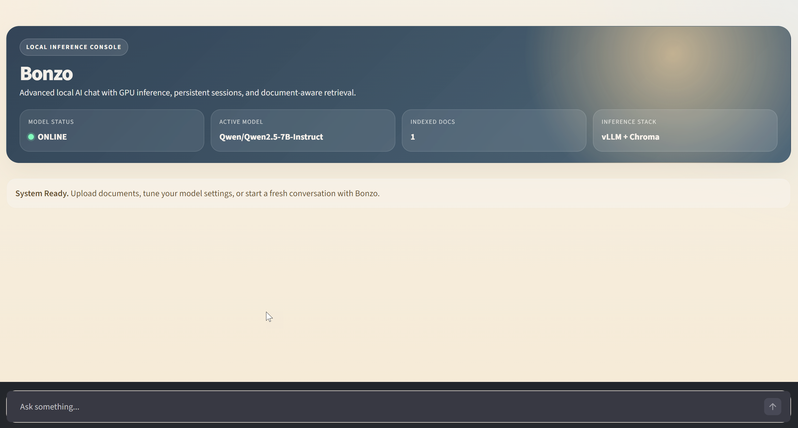
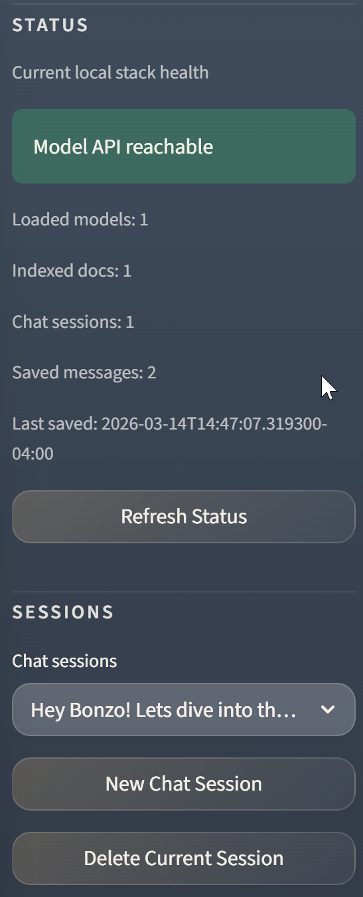
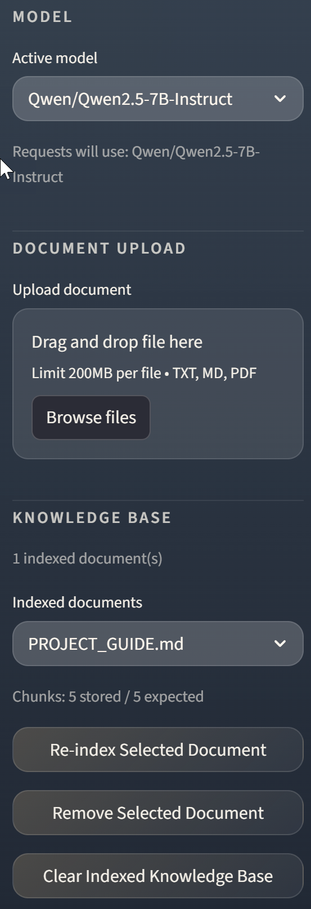
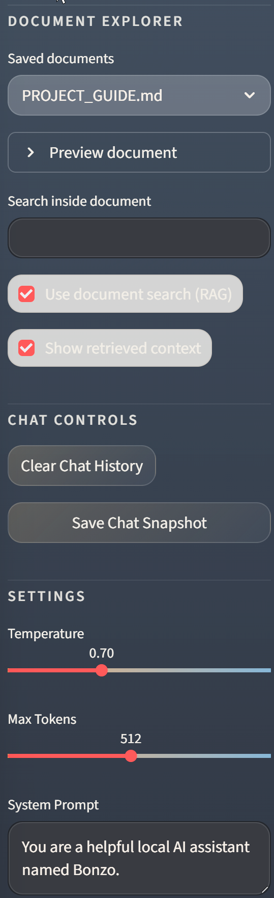
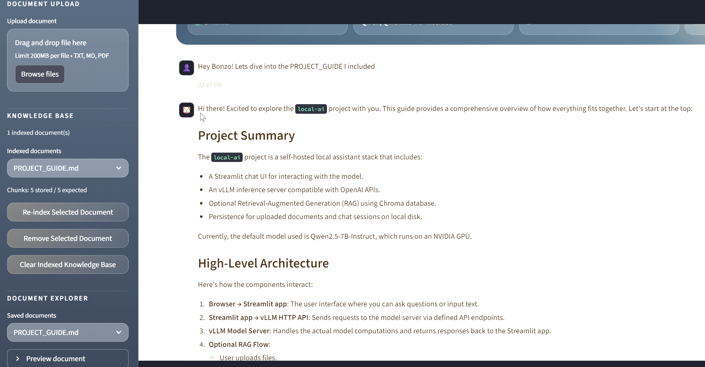

# Local AI

> A self-hosted local assistant stack built with Streamlit, vLLM, and optional RAG through Chroma, designed to keep your chats and documents on your own machine.

## At A Glance

| Area | Current Value |
| --- | --- |
| Default model | `Qwen/Qwen2.5-7B-Instruct` |
| UI | `http://localhost:8501` |
| vLLM API | `http://localhost:8000/v1` |
| Stack | Docker + Streamlit + vLLM + Chroma |
| Privacy model | Fully local, self-hosted |
| Primary runtime data | `docs/`, `chroma_db/`, `chat_history/`, `vllm/cache/` |

## Overview

`local-ai` is a single-machine local chat stack that gives you:

- a browser-based chat UI
- local model serving through vLLM
- OpenAI-compatible chat endpoints
- document upload for `txt`, `md`, and `pdf`
- persistent local RAG storage with Chroma
- saved chat sessions on disk
- document preview, search, and re-indexing tools
- a Docker-first workflow for running everything together

## Local-First Privacy

This project is built to run fully on your own machine.

- chat requests are served by your local `vllm` container
- uploaded documents are stored in your local `docs/` directory
- embeddings and retrieval data stay in your local `chroma_db/`
- saved conversations stay in your local `chat_history/`
- model weights and caches stay under your local `vllm/cache/`

In normal use, your prompts, chat history, and documents do not leave your house.

The main exception is model or embedding downloads from Hugging Face when you fetch models for the first time or refresh dependencies. After that, inference and retrieval run locally against your own files and containers.

For the full project walkthrough, architecture, configuration details, and troubleshooting guide, see [`docs/PROJECT_GUIDE.md`](./docs/PROJECT_GUIDE.md).

## Interface Preview

### Main chat experience



The main view is built for local-first chat: live model responses, persistent conversations, and optional document-aware answers without leaving the browser.

### Sidebar walkthrough

The sidebar is where Bonzo behaves more like a local control console than a simple chat app.

#### Status and sessions

`Status` surfaces model reachability, indexed-document count, and chat session state. `Sessions` lets you jump between saved conversations, start a fresh one, or remove the current thread.



#### Model, upload, and knowledge base

`Model` selects the active vLLM-served model. `Document Upload` ingests local files, while `Knowledge Base` handles re-indexing, removal, and full clears for the stored document set.



#### Explorer and chat settings

`Document Explorer` previews uploaded files and supports lightweight text search. `Chat Controls` and `Settings` handle history resets, snapshots, temperature, output length, and the active system prompt.



### Retrieval and sources



Retrieved chunks are shown with source-aware cards so you can see what context the answer is grounded in and which file the model is drawing from.

## Quick Start

From [`chat-ui`](./chat-ui):

```bash
docker compose up
```

Then open:

```text
http://localhost:8501
```

### When To Rebuild

Use `docker compose up` for normal day-to-day startup. The `chat-ui` service bind-mounts the local source tree into `/app`, so most Python code changes do not require rebuilding the image.

Use `docker compose up --build` when you change:

- [`chat-ui/dockerfile`](./chat-ui/dockerfile)
- [`chat-ui/requirements.txt`](./chat-ui/requirements.txt)
- anything else that affects the built image rather than the live-mounted app code

## Architecture

```text
Browser
  -> Streamlit app (chat-ui/app.py)
      -> app_state.py initializes Streamlit session state
      -> sidebar.py renders controls and settings
      -> ui.py renders chrome and chat history
      -> chat_flow.py handles each prompt/response cycle
      -> vLLM API (/v1/chat/completions, /v1/models)
          -> local Qwen model on GPU

Optional retrieval flow:
uploaded file
  -> saved and parsed by chat-ui/documents.py
  -> chunked and embedded in chat-ui/rag.py
  -> stored in chroma_db/
  -> retrieved context added to the prompt by chat-ui/chat_flow.py
```

## Current Setup

| Item | Value |
| --- | --- |
| Services | `vllm`, `chat-ui` |
| Model | `Qwen/Qwen2.5-7B-Instruct` |
| UI port | `8501` |
| API port | `8000` |
| Model API base | `http://vllm:8000/v1` |

### Current vLLM settings

| Flag | Value |
| --- | --- |
| `--dtype` | `bfloat16` |
| `--gpu-memory-utilization` | `0.90` |
| `--max-model-len` | `4096` |
| `--max-num-batched-tokens` | `2048` |
| `--max-num-seqs` | `4` |

These settings are the current stable local profile for this machine and provide much better headroom than the earlier 14B model setup.

## Why This Model

The current default model is `Qwen/Qwen2.5-7B-Instruct`.

It is the better fit for this machine because it gives:

- lower VRAM usage
- much more usable KV cache
- better room for multi-turn chat
- fewer token-limit failures
- better RAG headroom
- more stable startup behavior

## What The Repo Contains

| Path | Purpose |
| --- | --- |
| `chat-ui/app.py` | thin Streamlit entrypoint |
| `chat-ui/app_state.py` | Streamlit session-state initialization |
| `chat-ui/chat_flow.py` | prompt handling, retrieval orchestration, and streamed responses |
| `chat-ui/config.py` | shared app configuration and constants |
| `chat-ui/documents.py` | document upload, parsing, preview, and re-indexing helpers |
| `chat-ui/llm.py` | model status checks, prompt budgeting, and streaming helpers |
| `chat-ui/rag.py` | chunking, embeddings, retrieval, Chroma integration |
| `chat-ui/sessions.py` | chat session persistence and timestamps |
| `chat-ui/sidebar.py` | sidebar controls and settings UI |
| `chat-ui/ui.py` | top-level UI rendering helpers |
| `chat-ui/docker-compose.yml` | local two-service stack |
| `chat-ui/dockerfile` | Streamlit container build |
| `chat-ui/tests/test_rag.py` | RAG tests |
| `docs/` | uploaded documents and project documentation |
| `chroma_db/` | persisted vector store |
| `chat_history/` | persisted chat sessions |
| `vllm/cache/` | model and Hugging Face cache |

## Repo Layout

```text
local-ai/
|-- chat-ui/
|   |-- app.py
|   |-- app_state.py
|   |-- chat_flow.py
|   |-- config.py
|   |-- documents.py
|   |-- llm.py
|   |-- rag.py
|   |-- sessions.py
|   |-- sidebar.py
|   |-- ui.py
|   |-- docker-compose.yml
|   |-- dockerfile
|   |-- requirements.txt
|   `-- tests/
|       `-- test_rag.py
|-- chroma_db/
|-- chat_history/
|-- docs/
|   `-- PROJECT_GUIDE.md
|-- models/
|-- scripts/
|   `-- rewrite_rag.py
|-- vllm/
|   `-- cache/
|-- LICENSE
|-- pytest.ini
`-- README.md
```

## Configuration

### App environment

| Variable | Current Value | Purpose |
| --- | --- | --- |
| `VLLM_API_BASE` | `http://vllm:8000/v1` | model API base URL |
| `MODEL_NAME` | `Qwen/Qwen2.5-7B-Instruct` | default selected model |
| `VLLM_MAX_MODEL_LEN` | `4096` | UI-side request budgeting |
| `DOCS_DIR` | `/docs` | uploaded document storage |
| `CHROMA_DB_PATH` | `/chroma_db` | Chroma persistence |
| `CHAT_HISTORY_DIR` | `/chat_history` | saved sessions |

### Mounted local directories

The current compose file assumes this Windows layout:

- `G:/local-ai/vllm/cache:/root/.cache/huggingface`
- `G:/local-ai/docs:/docs`
- `G:/local-ai/chroma_db:/chroma_db`
- `G:/local-ai/chat_history:/chat_history`

If you move the repo or run it on another machine, these are the first paths to update.

## How It Works

### Chat flow

1. The user enters a prompt in the browser.
2. [`chat-ui/chat_flow.py`](./chat-ui/chat_flow.py) records the user message and optionally runs retrieval.
3. [`chat-ui/llm.py`](./chat-ui/llm.py) trims request size to fit the configured context budget.
4. The request is sent to vLLM.
5. vLLM streams tokens back to the UI.
6. [`chat-ui/sessions.py`](./chat-ui/sessions.py) saves the final response to `chat_history/`.

### RAG flow

1. A document is uploaded in the sidebar.
2. [`chat-ui/documents.py`](./chat-ui/documents.py) saves it to `docs/` and extracts text.
3. [`chat-ui/rag.py`](./chat-ui/rag.py) chunks and embeds the document.
4. Embeddings are created and stored in Chroma.
5. Matching chunks are retrieved during chat.
6. [`chat-ui/chat_flow.py`](./chat-ui/chat_flow.py) adds the retrieved context to the prompt.

## Hardware Notes

Recommended for the current setup:

- NVIDIA GPU with at least 16 GB VRAM
- 32 GB system RAM
- SSD storage
- Docker with NVIDIA GPU support

Minimum practical baseline:

- 8 GB to 12 GB VRAM depending on model choice and settings
- 16 GB RAM
- enough disk for model cache and vector data

## Troubleshooting

The most useful first checks are:

```bash
docker ps -a
docker logs --tail 200 vllm-server
docker inspect vllm-server --format '{{json .State.Health}}'
nvidia-smi
```

Common issues:

- vLLM startup failures usually point to VRAM or KV cache pressure
- token errors usually mean the request exceeds the active model context window
- slow first boot is often normal because model loading and compile warmup take time
- path issues usually come from machine-specific Windows mounts in `docker-compose.yml`

For detailed troubleshooting steps, see [`docs/PROJECT_GUIDE.md`](./docs/PROJECT_GUIDE.md).

## Development Notes

- `docs/`, `chroma_db/`, `chat_history/`, and `vllm/cache/` are runtime data locations
- the current stack is centered on the `chat-ui` application
- the compose file is still machine-specific because of the Windows host mounts

## License

MIT License. See [LICENSE](./LICENSE).
